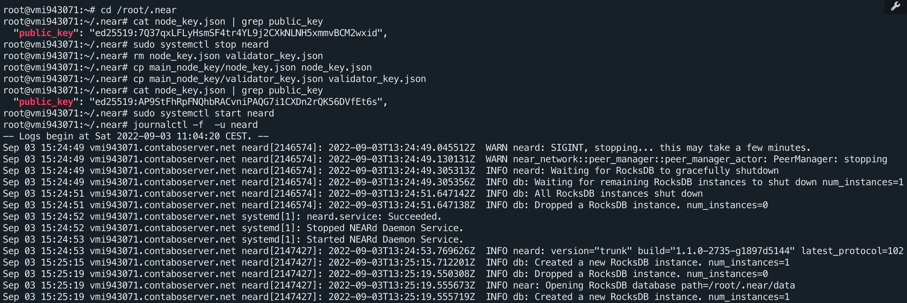

# 1.Backup backup node keys

connect to **backup node**:

```bash
cd /root/.near/
mkdir back_node_key
mkdir main_node_key
cp node_key.json validator_key.json back_node_key/
```

# 2.Trans main node keys to backup node

connect to **main node**:

```bash
cd /root/.near
scp node_key.json root@130.185.118.196:/root/.near/main_node_key/
scp validator_key.json root@130.185.118.196:/root/.near/main_node_key/
```

# 3. Stop main node

connect to **main node** and run :

```bash
sudo systemctl stop neard
```

# 4 Run validator in backup node

connect to **backup node** and run :

```bash
cd /root/.near
cat node_key.json | grep public_key
sudo systemctl stop neard
rm node_key.json validator_key.json
cp main_node_key/node_key.json node_key.json 
cp main_node_key/validator_key.json validator_key.json
cat node_key.json | grep public_key
sudo systemctl start neard
journalctl -f  -u neard
```


